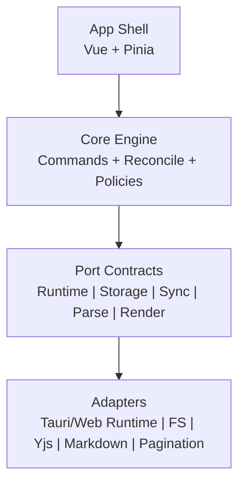
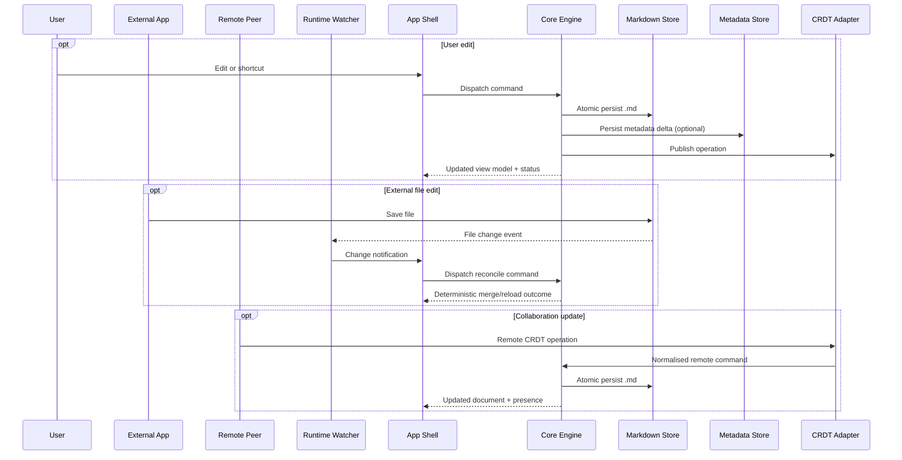

# Kea Architecture

> High-level system design for `docs/requirements.md` with clear boundaries, contracts, and data flow.

## Relationship to Requirements

- `docs/requirements.md` defines product behaviour, priorities, and acceptance criteria.
- This document defines architecture shape and implementation constraints.
- If there is any mismatch, `docs/requirements.md` is the source of truth.

## Architecture Invariants

1. Markdown (`.md`) is the canonical document format.
2. Local editing must always work, even when collaboration is unavailable.
3. User edits, external file edits, and collaboration updates all pass through one reconcile pipeline.
4. Runtime-specific capabilities (filesystem, networking, clipboard, windows) are accessed through ports.
5. Parser, renderer, collaboration, pagination, and metadata are adapter-backed and swappable.
6. Non-markdown data lives in companion metadata with explicit schema versioning and migrations.
7. Page mode is a variant of hybrid mode, not a separate editor model.

## Layered Model

- **App Shell**: Vue + Pinia UI state, command dispatch, and runtime wiring.
- **Core Engine**: framework-agnostic document/workspace/collaboration orchestration.
- **Port Contracts**: stable interfaces for runtime and subsystem capabilities.
- **Adapters**: concrete implementations (Tauri/web runtime, editor bridge, CRDT provider, parser, renderer, storage).

## Core Domains

- **Document Domain**: canonical markdown state, mode state (source/hybrid/page), undo/redo command history.
- **Workspace Domain**: project open/close/switch, file tree, file name search, open buffers.
- **Collaboration Domain**: CRDT session state, presence/cursors, invite/join lifecycle, reconnect policy.
- **Rendering Domain**: markdown parse/render, syntax highlight, math/diagram extensions, print/pagination rules.
- **Metadata Domain**: sidecar schema, versioning, deterministic migration, optional provenance/comments.
- **Assets Domain**: image ingest, relative path policy, attachment storage, and reference integrity.

## Canonical Data Model

- **Canonical content**: `.md` file text only.
- **Companion metadata**: sidecar store for non-markdown state (for example anchors, UI hints, optional provenance).
- **Derived/transient state**: render tree, selection, cursor presence, and sync status are recomputable.
- **Rule**: no feature may require a non-markdown canonical content store.

## Unified Command and Reconcile Pipeline

All mutations go through one path:

- user command in Kea
- external on-disk file change
- remote collaboration operation

Pipeline stages:

1. **Normalise** input into a core command.
2. **Apply** command against current canonical state.
3. **Reconcile** with conflict policy when concurrent/competing changes exist.
4. **Persist** markdown via atomic write and metadata as needed.
5. **Broadcast** domain events to UI and collaboration adapters.

This ensures deterministic behaviour for P0 external edit reflection and collaboration merges.

## DRY Enforcement

- One command model and validation path shared by UI, runtime, and collaboration inputs.
- One reconcile policy and persistence policy for all change sources.
- One parsing/normalisation rule set for rendering, export, and collaboration.

## High-Level Data Flow

## Runtime Parity Strategy

- Core engine logic is shared across Tauri and web runtimes.
- Runtime differences are isolated behind ports (filesystem, dialogs, clipboard, networking, notifications).
- Feature availability is capability-driven with graceful degradation where APIs differ.

## Mutability and Extension Strategy

- Port contracts are versioned with explicit compatibility windows and deprecation policy.
- Adapters register via capability descriptors to enable progressive replacement.
- Schema migrations are deterministic and reversible where possible.
- Boundary-impacting decisions are captured in short ADRs and linked here.

### ADR Index

- `docs/adr/README.md`

## Security and Privacy Boundaries

- Collaboration transport is encrypted in transit; optional session passphrase is enforced at session boundary.
- Optional relay/signalling never stores markdown document bodies.
- Discovery metadata is minimal and short-lived.
- Telemetry is explicit opt-in and isolated from document content.

## Accessibility, Keyboard, and UI Policy

- Shell layer owns accessibility and keyboard-first behaviour; core exposes intent-level commands.
- Theming is token-driven with light/dark parity and reduced-motion support.
- UI state is derived from core events to avoid divergent workflows across runtimes.

## Non-Functional Architecture Targets

- **Startup**: shell initialises fast and lazy-loads non-critical adapters to support a sub-3s cold start target.
- **Durability**: markdown writes use temp-file plus replace semantics.
- **External change reflection**: watcher and reconcile path target sub-1s reflection in typical local conditions.
- **Scalability**: rendering pipeline supports large documents through incremental/virtualised strategies.
- **Collaboration latency**: local echo remains immediate; remote updates target sub-250ms under typical broadband.
- **Memory stability**: avoid unbounded growth during multi-hour sessions via bounded caches and lifecycle cleanup.

## Technical Risks and Mitigations

| Risk | Impact | Mitigation |
|---|---|---|
| Divergent behaviour across runtimes | Breaks parity and user expectations | Capability-driven ports with contract tests and shared core use-cases |
| External edit conflicts | Data loss or user confusion | Single reconcile pipeline with deterministic merge policy and explicit UX messaging |
| Large document performance | Slow edits or UI stalls | Incremental parsing, virtualised rendering, and bounded caches |
| Collaboration drift or latency | Merge errors and poor UX | CRDT adapter validation, heartbeat/reconnect policy, and telemetry-free sync diagnostics |
| Metadata/schema evolution | Corrupted or unreadable sidecars | Versioned schema with deterministic migrations and rollback path |

## Modularity Rules

1. App shell calls core use-cases only; no direct adapter orchestration from UI components.
2. Adapters depend on ports; core depends only on port contracts.
3. Cross-cutting concerns (logging, metrics, errors) are implemented as middleware around commands/events.
4. New capabilities are introduced as adapters or domain services, not by bypassing layers.

## Requirement Coverage Map

| Requirement Area (`docs/requirements.md`) | Architectural Coverage |
|---|---|
| 0. Architecture & Data Model | Invariants, layered model, ports/adapters, canonical data model |
| 1-2. Editor and navigation | Document/workspace domains, mode model, unified command pipeline |
| 3. Real-time collaboration | Collaboration domain, CRDT adapter, unified reconcile path |
| 4. Files/workspace and external edits | Workspace domain, runtime watcher flow, deterministic reconcile policy |
| 5-6. Media and export/print | Assets domain + rendering domain + pagination adapter |
| 7-8. Runtime and resilience | Runtime parity strategy + local-first invariant + graceful degradation |
| 9. Security/privacy | Security and privacy boundaries |
| 10-12. Keyboard, accessibility, UI/UX | Accessibility/keyboard/UI policy + shell responsibilities |
| Non-functional requirements | Non-functional architecture targets |

## Delivery and Iteration (Scrum Alignment)

- Deliver vertical slices that satisfy acceptance criteria end-to-end.
- Each sprint increment updates core, adapters, and UI together to preserve parity.
- Definition of Done includes functional criteria, non-functional targets, and unified pipeline regression checks.
- Backlog items that change architecture include a boundary impact note and ADR when needed.

## Alignment Checklist

- Canonical markdown is the only persisted content format.
- External edits, local edits, and collaboration share the same reconcile path.
- Runtime-specific differences are isolated behind ports with capability checks.
- Adapters remain swappable without modifying core use-cases.
- Non-functional targets are measurable and tied to pipeline stages.
