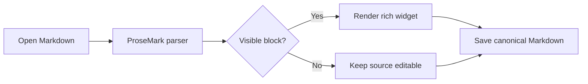
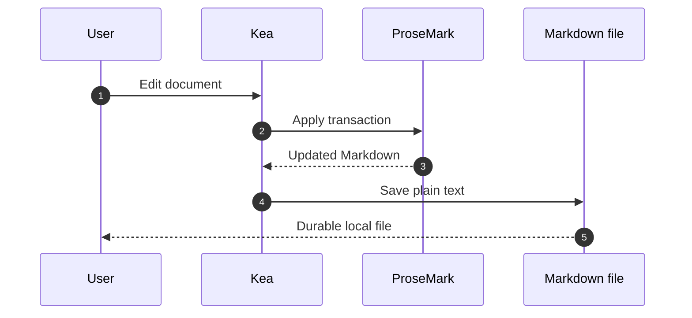
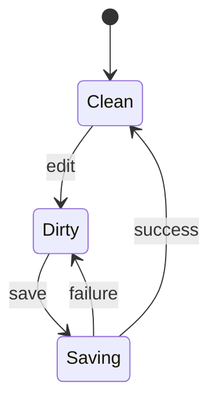

# Kea ProseMark Markdown Stress Test

This document exercises Markdown that Kea renders, Markdown it preserves as source, and performance-sensitive blocks. Editing and saving this file must leave the Markdown valid.
## 1. Headings

### Heading level 3

#### Heading level 4

##### Heading level 5

###### Heading level 6

Alternative heading level 1
===========================

Alternative heading level 2
---------------------------

## 2. Paragraphs, whitespace, and escapes

This is a normal paragraph. It contains Māori text — *kia ora* — plus café, naïve, 日本語, العربية, Ελληνικά, emoji 🚀, and symbols © ™ ✓ → ∑.

This line ends with two spaces.  
This line follows a hard break.

This line uses a backslash break.\
This line follows it.

Escaped punctuation: \*not italic\*, \_not emphasis\_, \# not a heading, \[not a link\], \`not code\`, \> not a quote, and 1\. not a list.

Multiple     spaces inside a paragraph should remain source text. A very long line follows to exercise horizontal measurement without introducing a document-size limit: alpha beta gamma delta epsilon zeta eta theta iota kappa lambda mu nu xi omicron pi rho sigma tau upsilon phi chi psi omega — repeated once — alpha beta gamma delta epsilon zeta eta theta iota kappa lambda mu nu xi omicron pi rho sigma tau upsilon phi chi psi omega.

## 3. Inline formatting

**Bold**, __bold with underscores__, *italic*, _italic with underscores_, ***bold italic***, ___bold italic with underscores___, ~~strikethrough~~, and `inline code`.

Nested formatting: **bold with *italic*, `code`, and a [link](https://prosemark.com)**.

Adjacent markers: **bold**then plain, *italic*then plain, and `code`then plain.

Compatibility syntax that should remain editable even if it is not rendered specially: ==highlight==, H~2~O, X^2^, ++inserted++, and --deleted--.

Inline code can contain Markdown markers: `**not bold**`, `<div>`, and ``code containing a ` backtick``.

## 4. Links and automatic links

[Inline link](https://prosemark.com "ProseMark documentation")

[Relative document](./README.md), [root-like path](/docs/example.md), and [fragment](#11-mermaid-diagrams).

[Reference link][prosemark], [numbered reference][1], and [shortcut reference].

<https://example.com/automatic-link?one=1&two=2>

<editor@example.com>

A bare GFM URL: https://example.org/path?q=kea#markdown

[prosemark]: https://prosemark.com "ProseMark"
[1]: https://github.com/jsimonrichard/ProseMark
[shortcut reference]: https://commonmark.org

## 5. Images and relative assets

Inline image using a real repository asset:


Reference-style image:

![Kea icon again][kea-icon]

[kea-icon]: ./src-tauri/icons/icon.png

Missing images should fail gracefully: 

## 6. Blockquotes and callouts

> A single-level quotation with **bold**, `code`, and a [link](https://example.com).
>
> A second paragraph in the same quotation.
>
> > A nested quotation.
> >
> > - A list item inside the nested quote
> > - Another nested item

> [!NOTE]
> GitHub-style callout syntax is a preservation case.

## 7. Lists

### Unordered lists

- Hyphen item
- Second item
  - Nested item
    - Deeply nested item
  - Nested sibling
- Final item

* Asterisk item
* Another asterisk item

+ Plus item
+ Another plus item

### Ordered lists

1. First step
2. Second step
   1. Nested first step
   2. Nested second step
3. Third step

42. This list deliberately starts at forty-two.
43. The next item follows.

### Mixed and loose lists

1. Plan the work
   - Identify the change
   - Review the result
2. Deliver the work

- A loose item with a paragraph.

  The indented paragraph belongs to the item.

- Another loose item.

### Tasks

- [x] Load the fixture
- [x] Render code blocks in dark mode
- [ ] Edit and save without changing unrelated source
  - [ ] Nested incomplete task
  - [x] Nested completed task

## 8. Horizontal rules

---

***

___

## 9. Code

Inline command: `npm run build`.

```typescript
interface DocumentState {
  path: string
  content: string
  dirty: boolean
}

const describe = ({ path, dirty }: DocumentState): string =>
  `${path}: ${dirty ? 'modified' : 'saved'}`
```

```javascript
const regexp = /markdown\s+editor/gi
console.log('<script> remains inert inside a code fence', regexp)
```

```json
{
  "name": "Kea",
  "editor": "ProseMark",
  "darkMode": true,
  "features": ["Markdown", "Mermaid", "MathJax"]
}
```

```rust
fn main() {
    println!("Kea");
}
```

```bash
npm run build
npm run test:unit
npm run build:legacy
```

```diff
- custom renderer
+ official ProseMark packages
```

```text
Plain fenced text preserves    spacing.
It also preserves Markdown such as **not bold**.
```

````markdown
A four-backtick fence can contain a normal fence:

```js
console.log('nested fence')
```
````

    This is an indented code block.
    It preserves leading whitespace.

## 10. GFM tables

| Feature | Syntax | Alignment | Expected result |
| :--- | :---: | ---: | --- |
| Bold | `**text**` | centre | **Formatted text** |
| Task | `- [x] item` | right | Checkbox source |
| Link | `[label](url)` | right | [Rendered link](https://example.com) |
| Escaped pipe | `one \| two` | right | one \| two |
| Empty cell |  | right | Empty value preserved |

Minimal table:

| A | B |
|---|---|
| 1 | 2 |

## 11. Mermaid diagrams







## 12. Mathematics

Inline maths: $E = mc^2$, $a^2 + b^2 = c^2$, and $\alpha + \beta = \gamma$.

Display maths:

$$
\int_0^1 x^2\,dx = \frac{1}{3}
$$

$$
\begin{aligned}
f(x) &= x^2 + 2x + 1 \\
     &= (x + 1)^2
\end{aligned}
$$

## 13. Raw HTML and entities

Inline HTML: <kbd>Command</kbd> + <kbd>S</kbd>, <mark>marked text</mark>, H<sub>2</sub>O, and x<sup>2</sup>.

<details>
  <summary>Expandable HTML block</summary>
  <p>This content is rendered from sanitised HTML.</p>
  <ul>
    <li>First HTML item</li>
    <li>Second HTML item</li>
  </ul>
</details>

<div class="markdown-fixture-card">
  <strong>Multi-line HTML block</strong>
  <p>Blank lines inside the block exercise ProseMark's extended HTML parser.</p>
</div>

Entities: &copy; &mdash; &amp; &lt;tag&gt; &quot;quoted&quot; &nbsp;.

Unsafe HTML preservation test (must never execute): `<script>alert('no')</script>`.

## 14. Source-preservation cases

The following constructs are intentionally included even when ProseMark has no special widget. They must remain ordinary editable Markdown rather than being discarded.

Footnote reference[^short] and repeated reference[^long-note].

[^short]: A short footnote definition.
[^long-note]: A longer footnote definition with **formatting** and a [link](https://example.com).

Term
: Definition-list style content.

Wiki-style links: [[Document name]] and [[Document name|custom label]].

Citation syntax: [@doe2026, pp. 10–12].

Emoji shortcode: :rocket: :sparkles: :kea:.

Attribute syntax: **important**{.highlight #important data-kind="fixture"}

Directive syntax:

::: note
This is a generic container directive.
:::

An HTML comment follows and should survive saving.

<!-- Kea preservation fixture: do not remove this comment. -->

## 15. Ambiguous and boundary cases

- Hyphenated-word-is-not-a-list
- `---` inside inline code is not a rule
- Hashes in text: issue #123 and colour #ff00aa
- Underscores inside identifiers: `document_store_value`
- Asterisks inside words: a*b*c
- Pipe outside table: one | two | three
- Brackets without links: [plain bracketed text]
- Parentheses without links: (plain parenthesised text)
- Empty link destination: [empty]()
- Empty emphasis markers: **** and ____
- Backslashes: Windows path `C:\Users\Kea\Notes\test.md`
- URL punctuation: <https://example.com/path_(with_parentheses)>

## 16. Repeated content for viewport parsing

The blocks below are deliberately repetitive. They exercise scrolling, viewport-only parsing, selection restoration, and incremental edits without making the fixture enormous.

### Repetition A

Paragraph A contains **bold text**, *italic text*, `inline code`, and a [link](https://example.com/a).

- A1
- A2
- A3

### Repetition B

Paragraph B contains **bold text**, *italic text*, `inline code`, and a [link](https://example.com/b).

- B1
- B2
- B3

### Repetition C

Paragraph C contains **bold text**, *italic text*, `inline code`, and a [link](https://example.com/c).

- C1
- C2
- C3

### Repetition D

Paragraph D contains **bold text**, *italic text*, `inline code`, and a [link](https://example.com/d).

- D1
- D2
- D3

## 17. Final validation checklist

- [ ] Opens without freezing
- [ ] Typing remains responsive near the beginning, middle, and end
- [ ] Cursor and scroll position survive tab switches
- [ ] Code blocks are legible in light and dark mode
- [ ] Mermaid diagrams render and unfold when selected
- [ ] Tables render and unfold when selected
- [ ] Local images resolve relative to this file
- [ ] Maths renders without a network connection
- [ ] Raw HTML is sanitised
- [ ] Saving preserves frontmatter, comments, and unsupported syntax
- [ ] Undo, redo, find, formatting, and insertion toolbar actions work

End of fixture.
